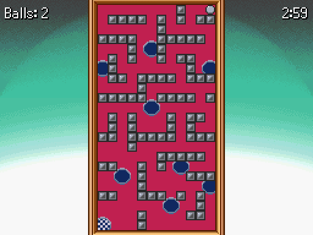
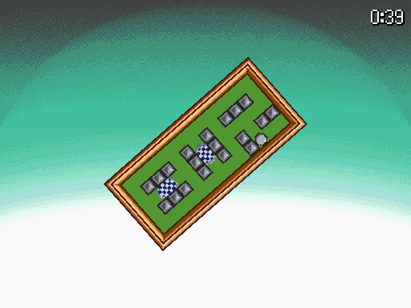
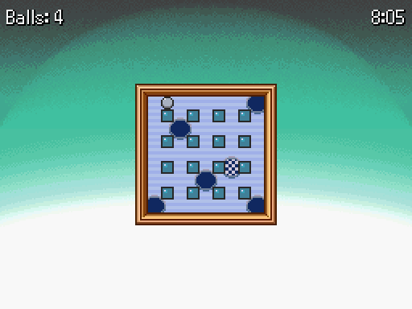
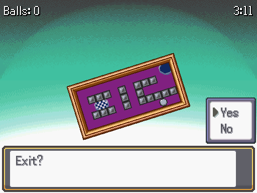

# Tilt Labyrinth Game
This script is for Pokémon Essentials. It's a simple minigame where the player must tilt a frame in order to make the ball fall into the goal.

## Screens

## Installation
Follow FL's [Essentials plugin installation instructions](https://github.com/FL-/Misc/tree/main/Guides/EssentialsInstallPlugin). For Essentials version 18.1 or lower, put the script above main.

## How to Use
Look at [Script](/Content/Plugins/Tilt%20Labyrinth/001_Tilt%20Labyrinth.rb) for instructions.

## Download
